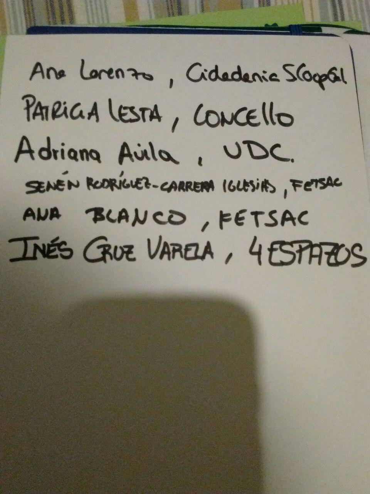
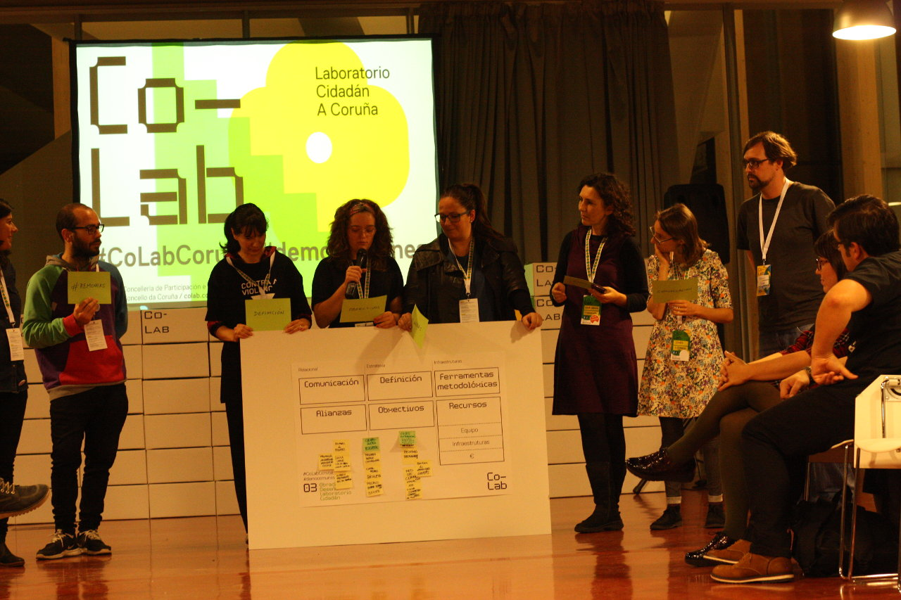

# Presentación do equipo

O equipo de mobilidade estivo integrado en total por 13 persoas, que foron variando ao longo das 3 fases. Destas persoas, 7 foron axentes (4 pertencentes a asociacións), 2 técnicas municipais e 4 pertencentes ao Concello e equipo de coordinación das cales 2 exerceron como facilitadores.

Estas persoas foron:

1. **Adriana Ávila** (Terapeuta ocupacional. Profesora da UDC) :one: :three:
- Alberto Varela (Enxeñeiro Camiños, coordinador Cartolab e Emapic) :one:
- **Ana Blanco** (FETSAC, asociación cultural que organiza un trabajo contrapuesto a la escuela de arquitectura de la ciudad) :one: :two: :three:
- **Ana Lorenzo** (Cidadanía *"SCoopGal"*) :one: :two: :three:
- Diego (Arquitecto Técnico) :one: :two:?
- **Inés Cruz Varela** (4Espazos) :one: :two: :three:
- Patricia Lesta (Concello) :three:
- **Senén Rodríguez-Carrera Iglesias** (FETSAC) :one: :two: :three:
- Xavier Seoane :one: :two:?

máis os facilitadores:

1. Natalia Balseiro (*Concello*) :one: :two:
- **Adrián Eirís** (Cartolab-Emapic) :one: :two: :three:

ademáis o venres á mañá (fase conceptualización) estiveron presentes dúas técnicas do Concello.

1. (Técnica 1) :two:
- (Técnica 2) :two:

##### *(en negriña as participantes que estiveron en todas as fases ata o final, os números correspóndense coas fases nas que participaron)*

#### Participantes F1:

#### Participantes F3:

#### Participantes F3 Posta en común final:

