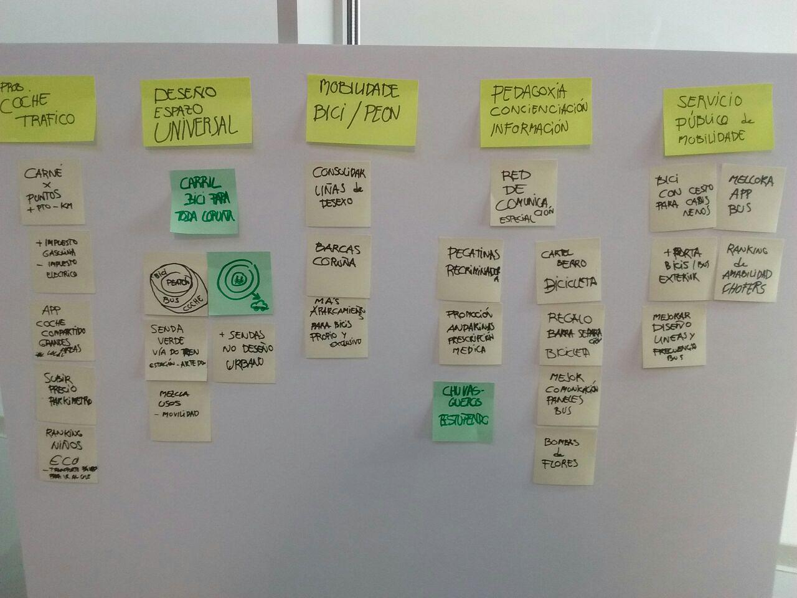
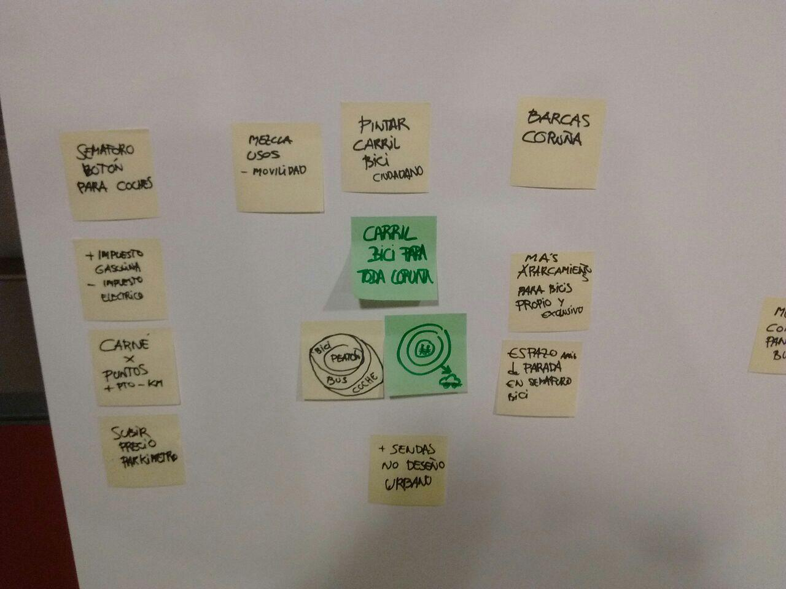
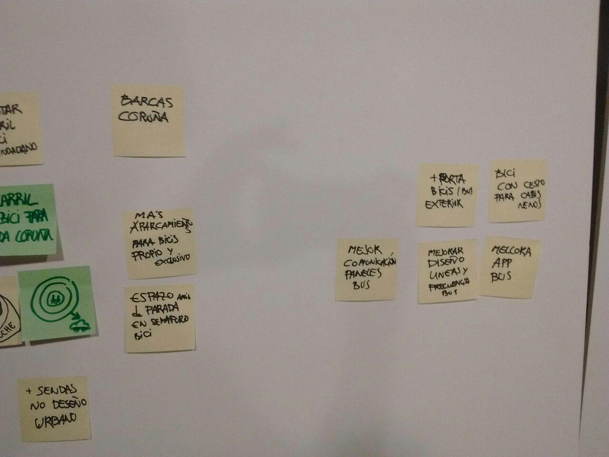

# Conceptualizar

:clock11: **11:00-12:30**

Nesta segunda fase propuxéronse accións concretas con base no benchmarking (identificación de boas prácticas e exemplos a seguir) da primeira fase.
Dado o reducido tamaño dos grupos non se fixeron subgrupos como estaba inicialmente plantexado e todas participamos xuntas no *brainstorming*.

Unha vez definidas un certo número de accións propostas, fíxose un agrupamento delas seguindo os conxuntos de problemáticas surxidos da fase de contextualización.

Despois fíxose un filtrado diferenciando entre o que se consideraron propostas plausibles que poderían ser desenvolvidas por grupos de traballo do Co-Lab, tendo en conta as normas de apertura, e aquelas que poderían definirse máis ben como peticións ou suxerencias ao Concello e que este podería resolver (dentro destas tamén parecen darse casos de propostas que poden ser inviables ou de proxectos que xa están parcialmente en marcha ou xa plantexados). Enténdese que ainda que non tan interesantes para a fase de prototipado e levar a cabo dentro do Co-Lab, poden ser válidas e deben quedar rexistradas e ser tidas en conta polos responsables e/ou técnicos do Concello ou ser integradas noutras plataformas de propostas existentes.

Nesta fase reduciuse o tempo previsto debido a que se tivo unha conversa entre os partipantes e responsables do concello acerca da naturaleza e obxectivos do obradoiro.

Debido a o filtrado e ao verse reducido o tempo do exercicio de xeración de ideas, non quedou un número excesivo de propostas a priorizar e xa que resultaban todas de interese e foi difícil descartalas, decidiuse conxuntamente ter todas as propostas en conta nun programa a desenvolver con distintas liñas de acción de cara ao prototipado.

##Accións concretas propostas:

#####***(en negriña as propostas finalmente seleccionadas).***

###Problemáticas coche-tráfico

- ***App* para compartir coche a nivel local.**
- **Concurso-ranking entre colexios de transporte sustentable para ir ao colexio.**
- Carné por puntos en función dos kilómetros percorridos.
- Subida do imposto vehículos a gasolina, baixada do imposto eléctricos.
- Subida do prezo dos parkímetros.

###Deseño espazo universal

- **Senda verde na vía do tren ao Burgo**
- Carril bici para/por toda a cidade
- Establecer zonas de exclusividade progresiva de medios de tranporte: peón-bici-bus-coche
- Favorecer o deseño de espazos nos que se misturen os usos (sen delimitación ríxida de plataformas para un uso concreto, calzada-carril bici-acera...)
- Máis sendas no deseño urbano

###Mobilidade bici/peón

- **Consolidar liñas de desexo de rutas a pé**
- **Deseño chuvasqueiros *guays* para ir en bici.**
- Máis aparcamentos públicos para bicis de uso privado (pechados: contenedores, aparcamentos de bici).
- Servizo de alquiler de barcas (como o de bicis)

###Pedagoxía, concienciación e información

- **Rede de comunicación especial para avisos incidencias para personas con mobilidade reducida (como avisos radares da DGT)**
- **Promover asociacións para que revindiquen os espazos para camiñar. Promoción das *andarinas por prescrición médica***
- **Pegatinas recriminadoras por malas conductas**
- **Bombas de flores (lanzamento de sementes en espazos verdes para facer máis agradables os traxectos a pé)**
- **Cartel berro bicicleta. Paneles xigantes para poñer os usuarios de bicicleta mensaxes aos conductores**
- **Regalar a ciclistas barras-marco separadoras para que os coches respeten as distancias**
- Mellorar a comunicación de información dos paneles do bus.

###Servizo público de mobilidade

- **Ranking de amabilidade dos conductores de bus**
- Bicis con asento-cesto para nenos
- Mellorar deseño de liñas e frecuencias do servizo de buses.
- Mellora da *app* de bus.

##Propostas-Suxerencias ao Concello

- Semáforos con botón para coches (invertindo o rol cos peóns que son os que teñen que pedir o paso habitualmente).
- Subida do imposto vehículos a gasolina, baixada do imposto eléctricos.
- Subida do prezo dos parkímetros.
- Favorecer o deseño de espazos nos que se misturen os usos (sen delimitación ríxida de plataformas para un uso concreto, calzada-carril bici-acera...)
- Establecer zonas de exclusividade progresiva de medios de tranporte: peón-bici-bus-coche
- Carril bici para toda a cidade
- Carné por puntos en función dos kilómetros percorridos (subvencións, descontos impostos...)
- Máis sendas no deseño urbano
- Servizo de alquiler de barcas (como o de bicis)
- Máis aparcamentos públicos para bicis de uso privado (pechados: contenedores, aparcamentos de bici)
- Espazos de parada preferente e exclusivo para bicicletas nos semáforos.
- Mellorar a comunicación de información dos paneles do bus.
- Mellorar deseño de liñas e frecuencias do servizo de buses.
- Mellora da *app* de bus.
- Porta bicis (exterior) para os buses.
- Bicis con asento-cesto para nenos

