# Contextualizar

:clock430: **16:15-16:30**
## Comezo da Fase 1 Contextualización. Dinámica "Tecer a rede".

Comezamos coa dinámica "tecer a rede" coa que nos coñecemos todos un pouco mellor (nome, perfil, que podemos aportar ao grupo).

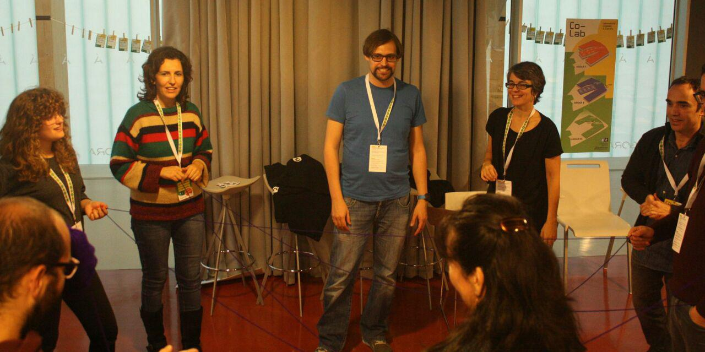

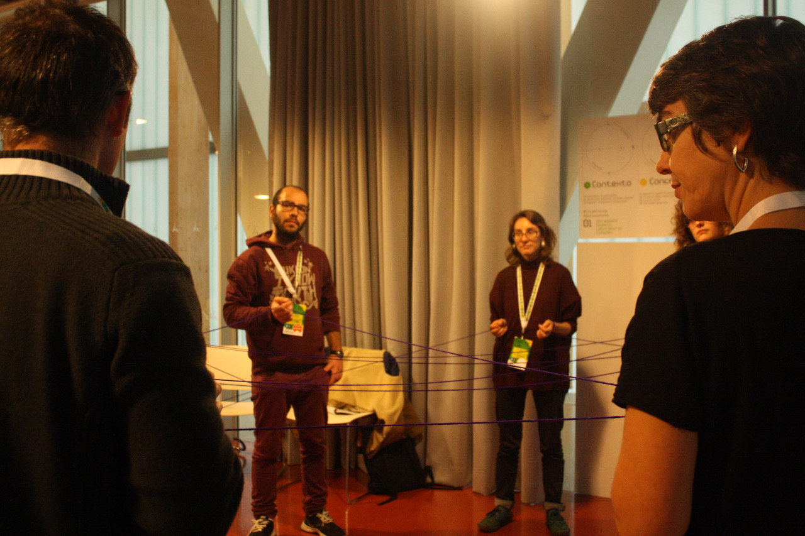

Vese que as participantes proveñen a maior parte de disciplinas técnicas (Enxeñería e Arquitectura) relacionadas coa temática, pero tamén de colectivos de acción social en xeral e en particular que traballan con persoas afectadas por enfermidades ou con discapacidade funcional.

---

:clock430: **16:45**
## Dinámica "Árbore". Brainstorming.

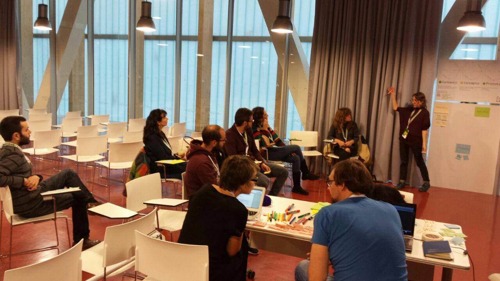

Decídese facer un *brainstorming* empregando *post-its* para cada idea suxerida nos paneis.

Primeiro identificanse problemáticas, ainda que inicialmente se suxería unha por persoa, este límite excediuse amplamente. Aínda así as participantes puideron facer unha breve explicación dos problemas aportados.

### Problemáticas que foron identificadas:

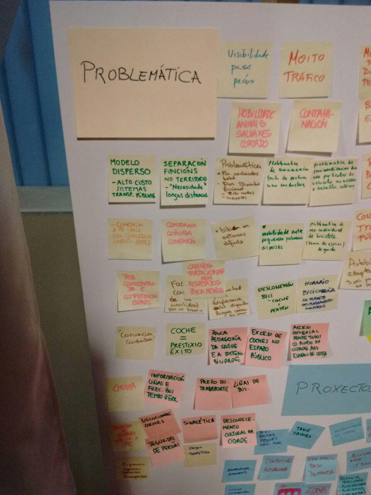

- **Modelo territorial disperso. Alto custo de sistema de transporte público.**
  - Ocupación do espazo de forma dispersa e polo tanto é dificil ter un transporte público para todos. Cuestionase o sistema de transporte público tal e como está concebido.

- **Barrios periféricos a lugares moi referenciais da cidade.**
- **Conexión en bici cos concellos veciños.**
  - Falta de conexión a pé e en bici cos Concellos do lado (Arteixo e Oleiros) e o perigo que conleva. 
  Persoas con mobilidade reducida entre a cidade e a súa contorna.

- **Bici en entornos difíciles. Non se pode chegar en bici a tódolos lados (rapaces). Trasporte en bicicleta dos adolescentes por toda a cidade.** 
- **Separación das funcións no territorio. Crean a necesidade de desprazarse longas distancias.**
- **Reparto do espazo público. Ter espazos para cada tipo de mobilidade ao final non deixa contento a ninguén.**
  - O territorio ten usos diferentes e polo tanto as necesidades de mobilidade son moitas, habería que buscar medidas que non sexan estándar. 
  
- **Acceso universal dende todos os puntos da cidade aos espazos de lecer. Necesidade de espazo común para todas (sen barreiras).**
- **Descoñecemento *cultural* da cidade. Falta de coñecemento das posibilidades da cidade: como moverse pola cidade, falta divulgación (non hai > non podemos). Dificultade para desprazarse entre lugares cercanos simplemente por descoñecemento das redes e posibilidades que ten a cidade. Falta de información sinxela sobre a cidade.**

- **Problema de desprazamento para carriños bebés e persoas con discapacidade funcional con mobilidade reducida (a veces o que fai falla é información). Tampouco o sabemos facer.**
- **Uso preferente do coche particular e de forma individual para desprazamento ao traballo.**
- **Concienciación de educación vial tanto conductores como peóns.**
- **Pouca pedagoxía da da saúde de da mobilidade sostible.**
- **Concentración en sitios e horas puntuais.**
  - Identificar puntos da cidade con moita afluencia de tráfico en horarios concretos (por temas laborais) para poñer transporte público.

- **Falta de aparcamentos públicos de bicicletas. Non hai espazos para gardar bicis para un particular, promover sitios públicos onde poder gardalas.**
- **O coche como elemento de prestixo. Coche = prestixio e éxito.**
- **Fai falta información en tempo real nas liñas e frecuencia do autobús (non funcionan ben).**
- **Prezo do transporte público.**
- **Liñas do bus (hai sitios que tardan 45 minutos en pasar).**
- **Exceso de coche no espazo público. Ocupación polos coches dos espazos públicos.**
  - Empoderamento cidadá probando a peonalización pechando provisionalmente as rúas. 
  Peonalización do centro. Non ter o coche diante todo o tempo. 
  
- **Velocidade dos coches.**
- **Seguridade das persoas.**
- **Sinalización.**
- **Choiva. Promove o uso do coche e dificulta a adopción doutros medios (bici, a pé).**
- **Mobilidade dos animais salvaxes. Corredores ecolóxicos.**
- **Contaminación (polución, ruido...)**
- **Dureza do espazo cando vas a pé. Espazo desolador, non agradable.**
- **Mobilidade peoníl difícil e perigosa.**
- **Percorridos peonís complexos (liñas de desexo).**

- **Moito tráfico.**
  - Falta de cálculo de coste/beneficio real do uso do coche.

- **Pouca amabilidade dos condutores do transporte público. Velocidade excesiva.**

- **Autobús adaptado.**

- **Alteración e desaparición de camiños tradicionais para construir cousas novas. Necesidade de recuperación e respecto dos camiños de sempre.**

- **Falta de espazo para aparcar (e subir e baixar) nos aparcamentos para persoas con discapacidade.**

- **Beirarrúas estreitas.**

- **Falta de visibilidade dos pasos de peóns.**

- **Paseo marítimo (aspectos de deseño, distribución dos espazos).**

- **Horario BiciCoruña. Que as bicicletas de alquiler poidan ser por un tempo longo no que as usuarias se poidan facer responsables delas.**

### Axentes identificados:

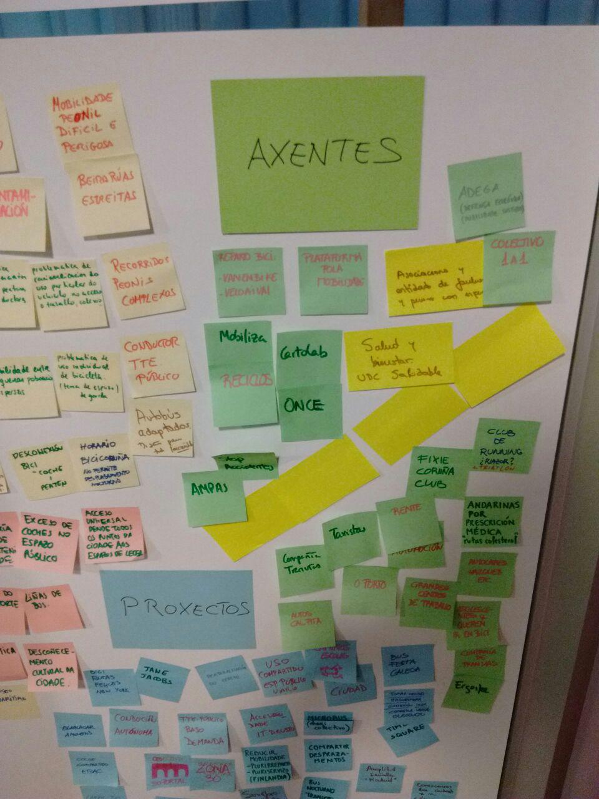

Nesta parte identificáronse dous tipos de axentes, uns serían axentes que realizan proxectos interesantes e na liña de mobilidade sustentable, e outros, que simplemente son axentes importantes que prestan un servizo na cidade e é preciso ter en conta.

#### Axentes ou actores importantes a ter en conta:

- **Porto da Coruña (tamén en canto a tráfico de camións)**
- **Compañía de Tranvías**
- **Autos Cal-Pita**
- **Autocares Vázquez**
- **Taxistas**
- **Sector automoción (tamén concesionarios)**
- **Grandes centros traballo (Inditex, A Grela...)**
- **Renfe**
- **Clubes deportivos (*running*, bicicleta, triatlón)**

	- *Fixie Coruña Club* ¿?

#### Axentes que fan proxectos ou iniciativas interesantes ou minorías que se creiu que deben ter voz e participar:

- **Mobiliza-Reciclos**
- **Plataforma pola mobilidade**
- **Rede Salud y Bienestar - UDC Saludable**
- **Ecoloxistas (Adega...)**
- **Stop Accidentes**
- **Cartolab**
- **AMPAS**
- **Adolescentes que queren ir en bici**
- **Colectivo 1 a 1**
- **ONCE**
- **Asociacións persoas con afeccións e mobilidade reducida (Alzheimer, transplantados, cardiopatías...)**
- ***Personas andarinas por prescripción médica* (refírese en xeral a grupos de persoas que realizan actividade de andar a pé de forma análoga á xente que corre).**
- **Ergosfera**
- *Arquitectos Mobilidade con proceso participativos* ¿?
- *Velaivai*

### Proxectos interesantes:

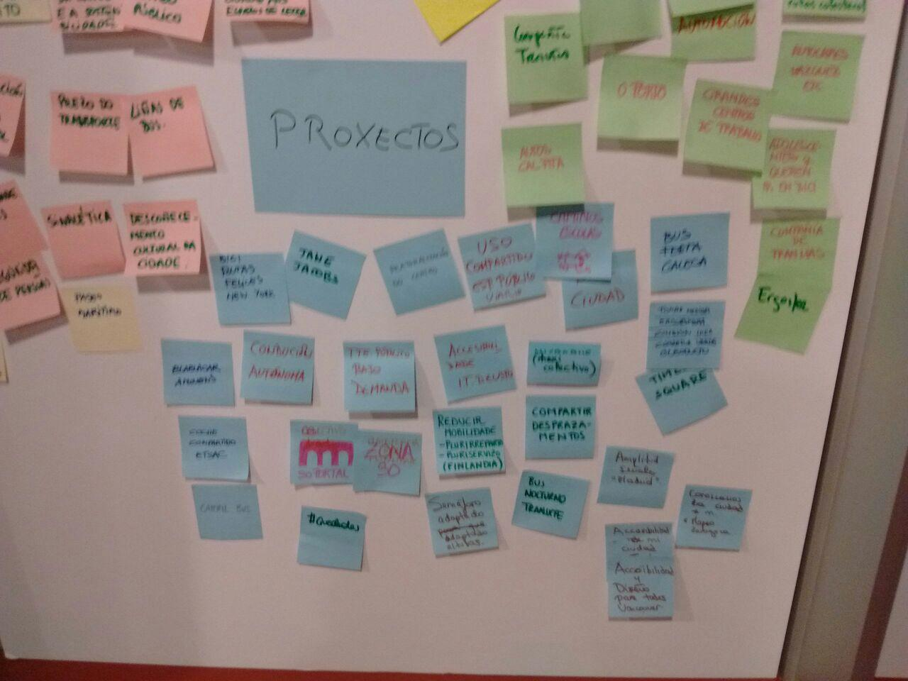

##### *(Os proxectos surxidos teñen base en proxectos existentes ainda que non se faga referencia explícita a eles, de moitos non se puido referenciar o nome ou proxecto real).*

- **Proxecto de peonalización Times Square, Nova Iorque (pintando liñas e con conos na rúa. Prototipar as rúas peonís a través de pintado do espazo.**
- **Jane Jacobs. A solución a todo non é a peonalización nin os carriles bici, senón que tamén pasa pola redistribución e uso compartido do espazo público).**
- **Servizo que suxire rutas en bici alternativas. Non só ruta rápida senón agradable, cómoda, con árbores... (Nova Iorque?)**
- **Transporte baixo demanda (non se poden poñer liñas contínuas), sobre todo en zonas rurais.**
- **Estudos de accesibilidade peonil (Instituto Tecnolóxico de Deusto) para planificación de equipamentos accesibles.**
- **Condución autonoma (Google)**
- **Cooperativas de usuarias de coche compartido, ou alternativas con grupos máis pechados/familiares.**
- **Servizos de compartir / alquiler coches como as bicis (*Uber*, *Bla bla car*)**
- **Proxecto que estudou a dispersión para reducir a necesidade de mobilidade (plurirreparto e pluriservizo, en Finlandia).**
- **Soportais de Santiago (non é un proxecto pero a idea de deseñar a cidade dun xeito máis vivible).**
- **Zonas 30**
- **Camiños escolares (rás pintadas no chan).**
- **Buses especializados para eventos/festas en Galicia (por exemplo, en veráns en Ourense).**
- **Autobuses nocturnos, BUHO. Incentivar para eventos susceptibles de interese para a mocidade.**
- **Proxectos premiados de accesibilidade e deseño para todos (Vancouver, Xapón) que fan fincapé no mapeo e a sua divulgación de forma escrita. Indican se hai barreiras, relieve, etc. de traxectos a lugares habituais en diferentes medios de transporte, por exemplo, cómo ir ó CHUAC, á praza X, á escola Z...**
- **Amplitude do tamaño dos sinais de autobuses (para facilitar a lectura por parte persoas con visibilidade reducida; nenos, maiores...), Madrid.**
- **Semáforo adaptado para diferentes alturas (Colombia).**
- ***Conozcamos la ciudad* (mapeo en Zaragoza)**
- **Quedadas para andar en grupo como as feitas por Masa crítica, Mobiliza, Plataforma mobilidade...**
- **Carril bus**
- **Peatonalización do centro**
- Corredor verde do oleoducto. 
- Proxecto *Tomar medidas* (na Normal?)
- Proxectos de *Bici-Ciudad*, bicis compartidas
- Proxectos de compartir garaxe (Coruña ten?)
- Transporte incentivado por parte das empresas.
- Colocar bicis nos hospitais da cidade.
- Amberes ¿?

#### Resultado da identificación dos problemas, axentes e proxectos:

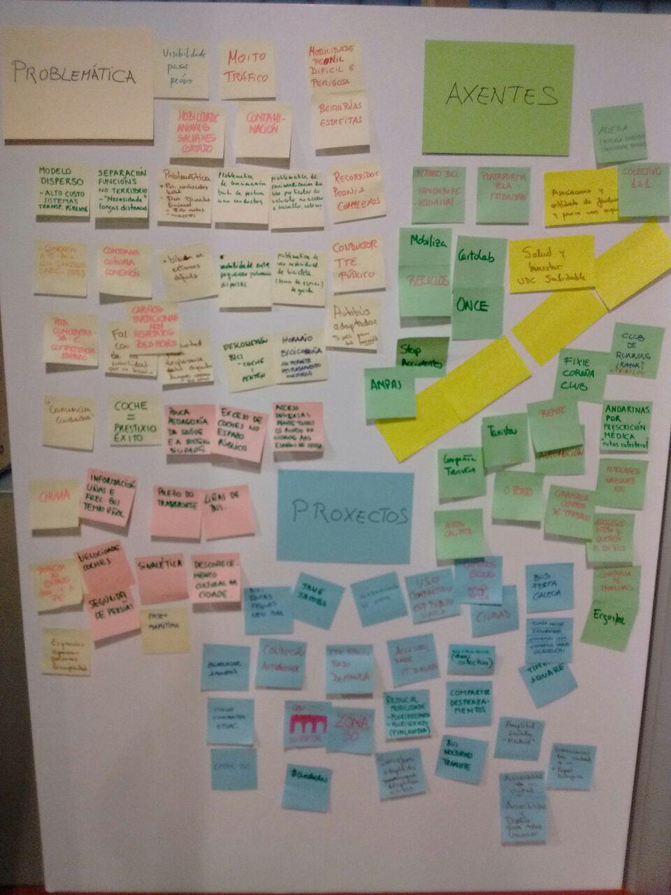

---

:clock6: **18:00**
## Clusterización

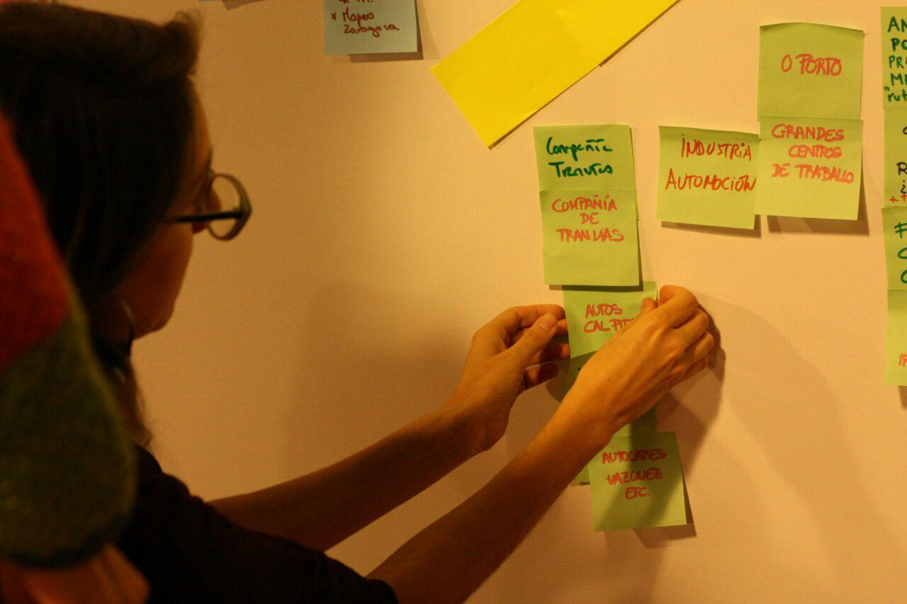

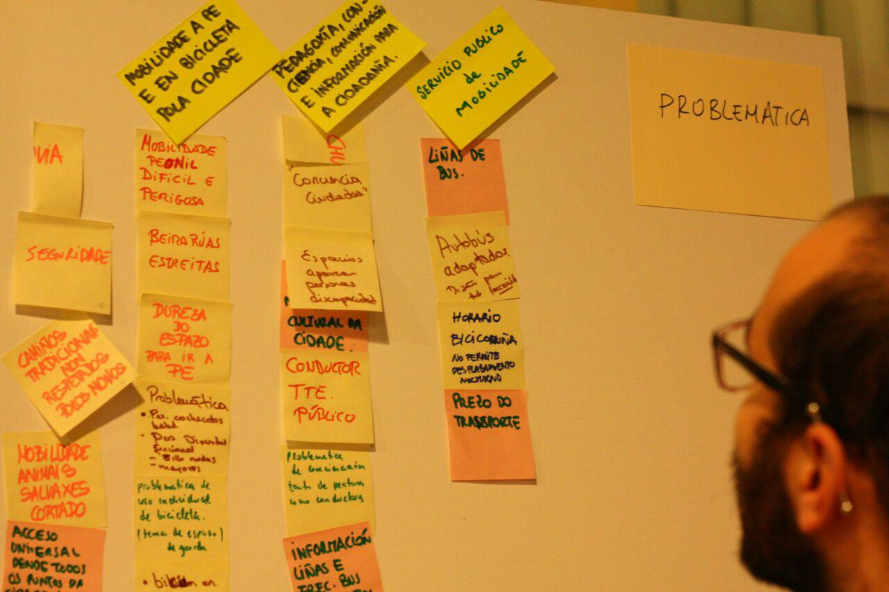

No proceso de clusterización agrupáronse as distintas problemáticas, axentes e proxectos en conxuntos amplos.

### Problemática:

- **Uso do coche e problemática do tráfico**
  - Exceso de tráfico, de velocidade dos coches. Contaminación. Coche=Prestixio social.
  
- **Criterios xerais para o deseño universal do espazo público e a accesibilidade**
  - Seguridade. Camiños tradicionais. Corredores ecolóxicos. Modelo disperso. Paseo marítimo...
  
- **Mobilidade a pé e en bicicleta pola cidade**
  - Mobilidade peoníl difícil e perigosa. Beirarrúas estreitas. Dureza do espazo, non agradable para ir a pé. Percorridos a pé complexos...

- **Pedagoxía, conciencia, comunicación e información para a cidadanía**
  - Concienciación. Descoñecemento da cidade e necesidade de información. Información de liñas e percorridos e comportamento dos condutores do transporte público. Sinalización. Visibilidade dos pasos de peóns. Pedagoxía da saúde e da mobilidade sostible.

- **Servizo público de mobilidade**
  - Prezo do transporte. Liñas de bus. Autobuses adaptados. Horario BiciCoruña.

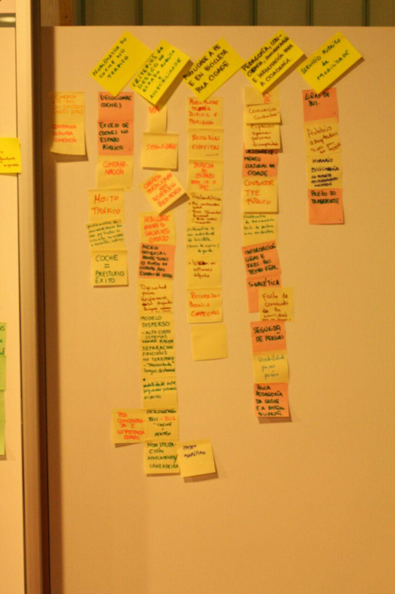

### Proxectos:

- **Amortiguar o uso do coche**
  - Servizos para compartir desprazamentos e aparcamento

- **Deseño universal do espazo público e accesibilidade**
  - Peonalización do centro, deseño accesible, camiños escolares, soportais, zonas 30

- **Servizos públicos**
  - Buses nocturnos e especializados para eventos/festas, semáforo adaptado a diferentes alturas, transporte baixo demanda

- **Coñecemento compartido**
  - Quedadas, servizos de suxerencia de rutas alternativas en bici, *Times Square*, Estudos de accesibilidade e deseño...

### Axentes:

- Axentes especializados
  - Plataforma pola mobilidade, Stop accidentes, Reciclos-Mobiliza, grupos ecoloxistas (Adega...), grupos de traballo da UDC (Cartolab, Salud y Bienestar - UDC Saludable), Colectivo 1 a 1, Ergosfera...
  
- Organizacións de persoas usuarias
  - ONCE, AMPAS, asociacións que traballan con persoas con discapacidade funcional, grandes centros de traballo (Porto, Polígonos Industriais...), persoas *andarinas por prescripción médica*...

- Outros actores a ter en conta
  - Empresas autobuses (Compañía de tranvías, Autos Cal-Pita, Autocares Vázquez), taxistas, Renfe, Industria automoción, Porto da Coruña, Clubes deportivos (*running*, bicicleta, triatlón)...
  

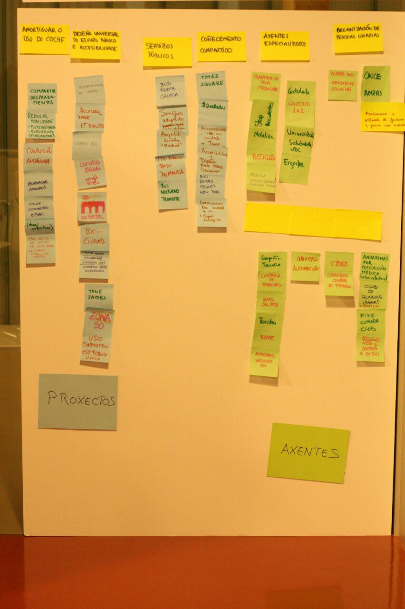

---

:clock7: **19:00**
## Posta en común plenaria

Finalmente Senén e Inés espuxeron o resultado desta fase en plenario:

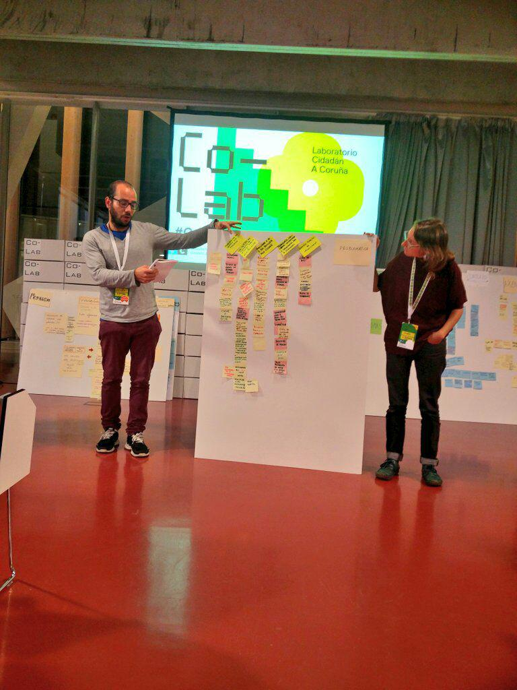
