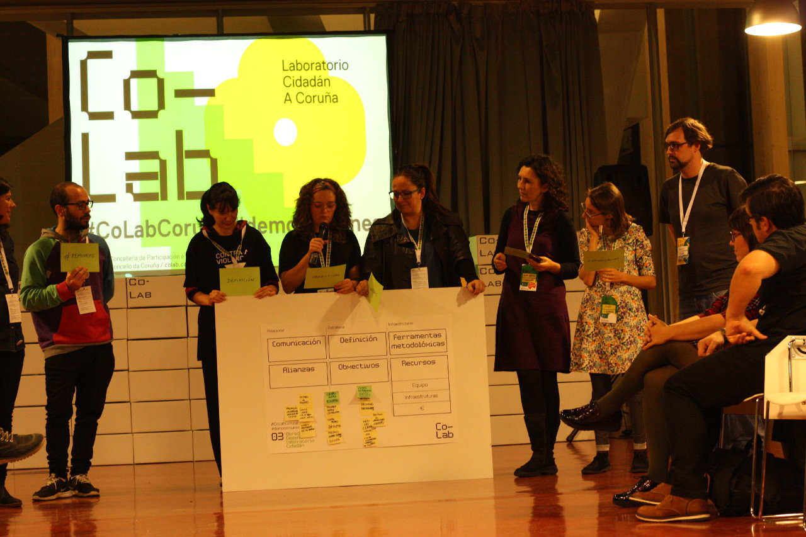

# Prototipado

:clock5: **17:00**

(Empézase con moito retraso debido o debate surxido no plenario)

O grupo cree necesario unha pequena conversa en referencia ao debate surxido no plenario e falamos e intercambiamos opinións con calma durante uns minutos.

:clock530: **17:30**

Finalmente definense 3 grandes bloques de accións:

## Guerrilla urbana

(pequenas accións que mitiguen o mal deseño dos ambientes ao camiñar e fagan conciencia)

- Bombas de flores

- Promover asociacións para que revindiquen os espazos para camiñar. Promoción das *andarinas por prescrición médica*

- Regalar a ciclistas barras-marco separadoras para que os coches respeten as distancias

- Senda verde na vía do tren ao Burgo

- Espazos de parada preferente e exclusivo para bicicletas nos semáforos.

## Chuvasqueiros

(Mobilidade bici/peón)

- Chuvasqueiros

- Pasarela-desfile chuvasqueiros

- Cartel berro bicicleta. Paneles xigantes para poñer os usuarios de bicicleta mensaxes aos conductores

## Información e sensibilización

(Pedagoxía, concienciación e información)

- Concurso-ranking entre colexios de transporte sustentable para ir ao colexio.

- Pegatinas recriminadoras de malos comportamentos.

- Rede de comunicación especial para avisos incidencias para personas con mobilidade reducida.

- Ranking de amabilidade dos conductores de bus.

- *App* para compartir coche a nivel local.

---

## Canvas

### DEFINICION

**\#Removete**

Pensarte a ti mesma movéndote dunha forma diferente.

Multiples pequenas accións concretas (de creación, de guerrilla) que axudan á pedagoxía e concienciación.

### OBXETIVOS

- Cambiar hábitos de mobilidade
- Cambiar a forma de pensar a mobilidade
- Mellorar a habitabilidade dos percorridos
- Promover unha comunidade (tipo *runners*: **"as removers"**)
- Xerar orgullo *remover* e convertirse na envexa de toda A Coruña

### FERRAMENTAS METODOLOXICAS

- Talleres de contrucción de utensilios para as *removers*
- Quedadas, ferramentas de xestión de grupos
- Ferramentas de mapeado, aporte de datos e repositorio
- Chamadas abertas, convocatorias
- Concursos

### COMUNICACIÓN

- Contactos persoais
- Campañas
- Postos de avituallamento
- Vídeos

### RECURSOS

(non chegaron a definirse)

---

:clock7: **19:00**

Fíxose unha dinámica final para comentar as sensacións persoais do obradoiro.

---

:clock730: **17:30**

## Posta en común plenaria

